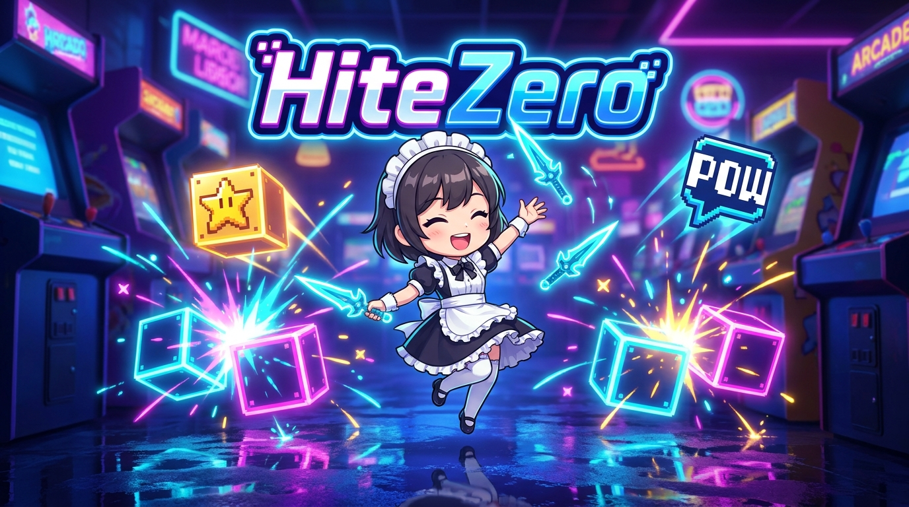
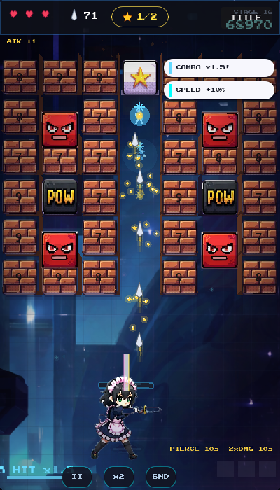
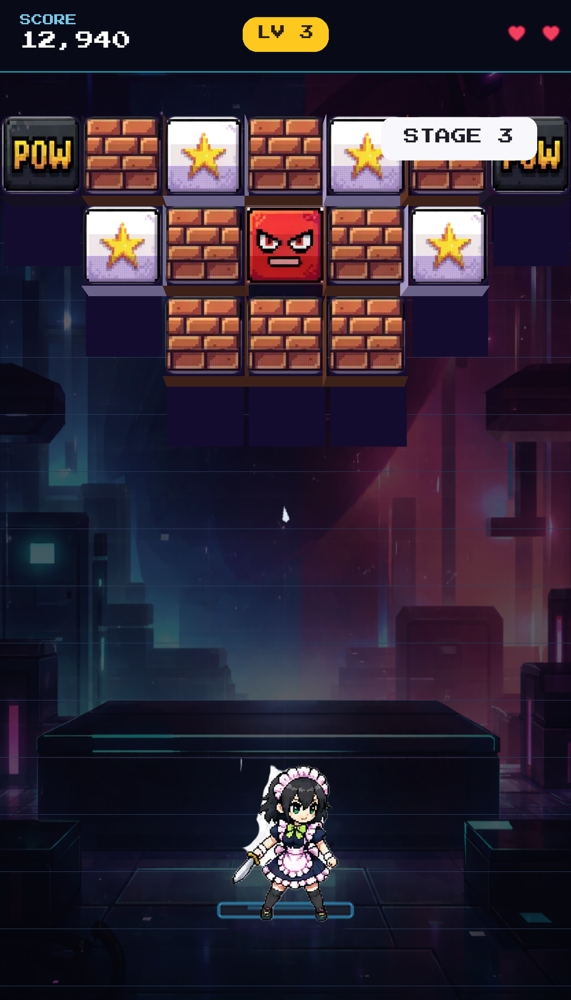
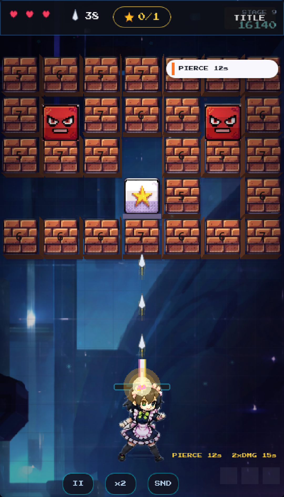
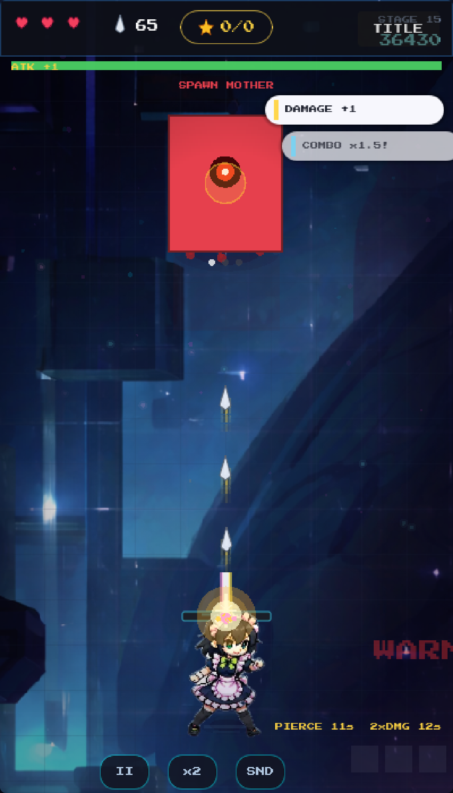

# HiteZero — Neon Knife Arcade



> Throw knives, ricochet them off the walls, and smash every neon block on the board.
> A fast, one-thumb neon arcade game — a fresh twist on the classic brick breaker.

<p>
  
  
  
  
</p>

---

## What is it

HiteZero is a free, fully-offline arcade game built in **Godot 4.6.2**. Drag to aim, release to fire,
and let your knives **ricochet off the walls and tray** to clear the board. Bank shots and ricochet
chains let the best players wipe out half the board in a single flick — simple to learn, satisfying
to master.

- **100% free** — no in-app purchases, ever
- **No ads** — zero interruptions
- **Fully offline** — no account, no sign-up, no data collected (only `VIBRATE` permission)

## Screenshots

<p>
  
  
  
  
</p>

## How to play

- **Drag to aim, release to throw** — pure one-hand control (mouse drag or touch). Desktop also supports `A`/`D` / arrow keys.
- Clear every **STAR** block to finish the stage.
- Trigger **POW** blocks for a radial knife burst.
- Stop the falling **RED ENEMY** blocks before they reach the bottom — let one through and you lose a heart (3 to start).
- Catch glowing **orbs** for power-ups (pierce, spread, magnet, blast, shield, slow) and grab **coins** to buy permanent upgrades.
- Survive escalating stages, chain **combos** (up to 5×), and take on **boss fights**.

## Features

- Ricochet physics with bank shots and tray juggles
- Combo system (4 tiers, up to 5× multiplier) with rising audio pitch
- 6 power-up items, 8 permanent upgrades, a coin economy, and run stats
- Boss encounters with health bars and telegraphed patterns
- CEL 2.5D neon visuals — wet-floor reflections, fake-3D slab depth, particle VFX
- Game feel: trauma-based screen shake, gameplay-scoped hit-stop, haptics
- Accessibility: screen-shake intensity toggle (Full / Low / Off), persistent mute

## Tech stack

| | |
|---|---|
| Engine | Godot **4.6.2**, GL Compatibility renderer (mobile-friendly) |
| Language | GDScript |
| Design resolution | 400 × 700 (portrait) |
| Android | `com.gghf.hitezero` · v1.0.0 · arm64-v8a · target SDK 35 · `VIBRATE` only |
| Web | HTML5 export (single-threaded / "nothreads"), static-host friendly |
| Save | Local `user://save.cfg` (offline; nothing leaves the device) |

## Build & run

This is a standard Godot project — the game lives in [`godot/`](godot/). Open `godot/project.godot`
in the Godot 4.6 editor and press play, or use the helper scripts:

```bash
# Web (HTML5) — exports + assembles a static site under dist/godot-web/site_nothreads
bash godot/tools/build_web.sh dist/godot-web

# Android (signed AAB + APK) — via GitHub Actions
#   push a tag (git tag v1.0.0 && git push origin v1.0.0) or run the
#   "Android (AAB + APK)" workflow manually; signing uses repo secrets.
```

## Project structure

```
godot/
├── project.godot            # Godot 4.6 project (autoloads, display, rendering)
├── scenes/                  # boot → title → game (+ block, knife, player, hud)
├── scripts/                 # game_root, hud, boss, player, level_generator, session, ...
├── assets/                  # textures, shaders, fonts
├── tools/                   # build_web.sh, deploy_netlify_polished.sh, tests
└── docs/                    # gameplay_spec (contract), release guides, design plans
store_assets/                # store listing: icon, feature graphic, screenshots, key art
.github/workflows/           # android.yml — signed AAB/APK CI
```

## Status

🟢 **v1.0.0 — launch-ready.** Signed AAB built and verified (emulator boot + bundletool split
install); store assets, screenshots, and listing copy prepared. Google Play submission in progress.

## License

Licensed under the **GNU Affero General Public License v3.0** — see [LICENSE](LICENSE).
